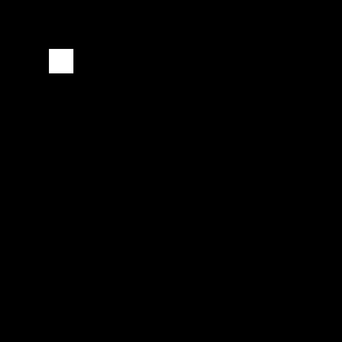
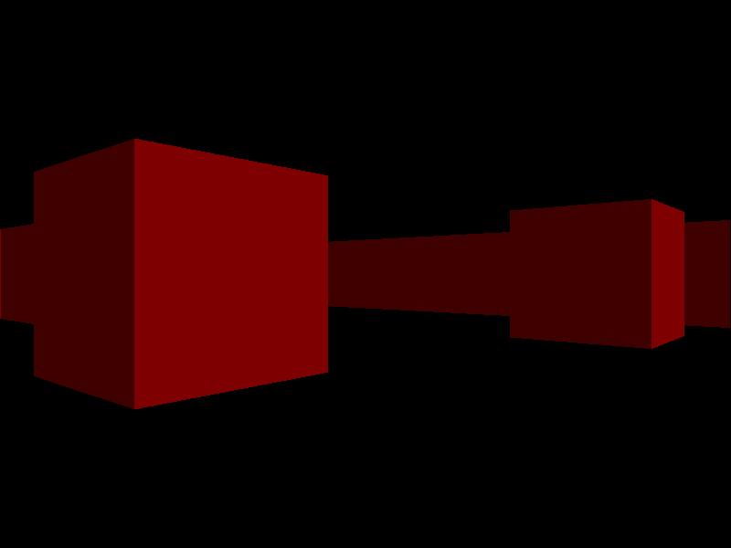

> [!WARNING]
> Library in the early stage of development.

# YAGL (Yet Another Graphic Library)

Yagl is a simple and easy to use library for creating OpenGL based applications.

## Possibilities
 - Draw basic shapes
 - Render textures (Almost all existing formats)
 - Collision shapes
 - ttf/otf fonts rendering
 - 2D Camera that can move, zoom and rotate
 - Mouse and keyboard input
 - **SOON**: Audio
 - **SOON**: Shaders support

## Getting started with basic example
```C
#include <yagl.h>

int main() {
    InitWindow("Yagl Basic Example", 699, 699);

    while (!WindowClosed()) {
        ClearScreen(); // Start drawing
            DrawRect((Vec2){ 100., 100.}, (Vec2){ 150., 150.}, WHITE);
        SwapBuffer(); // End drawing
    }
    return 0;
}
```
Compile:
```shell
clang basic_example.c -o program -lyagl
# or other compiler
```
### Output



# --------------------Extra--------------------


## Raycasting example


## Social links
 - Telegram: https://t.me/imperativeprogru (ONLY FOR RUSSIAN SPEACKERS)

# TODO
 - **[ACTIVE]** Complete and fix shapes
 - **[PLANNED]** Add some kind of window global data
 - **[PLANNED]** Gamepad support
 - **[ACTIVE]** Fix colors
